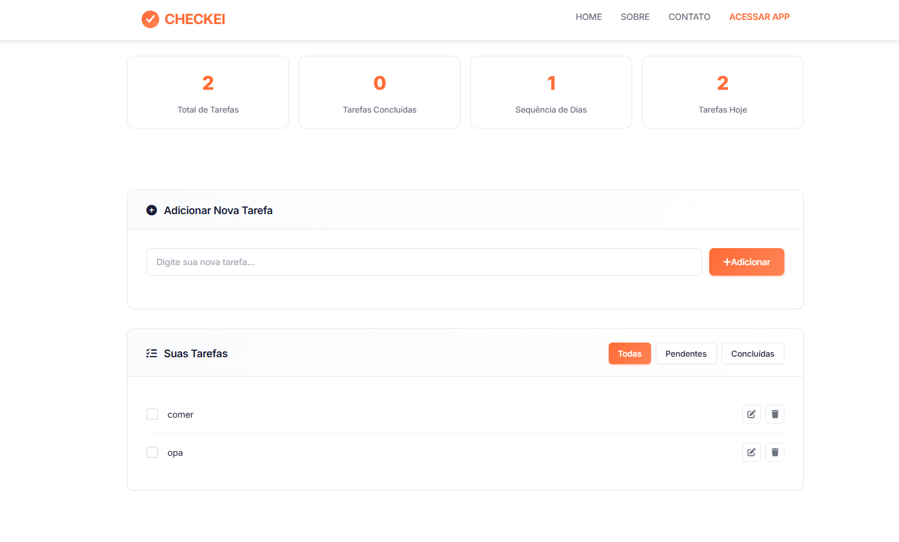
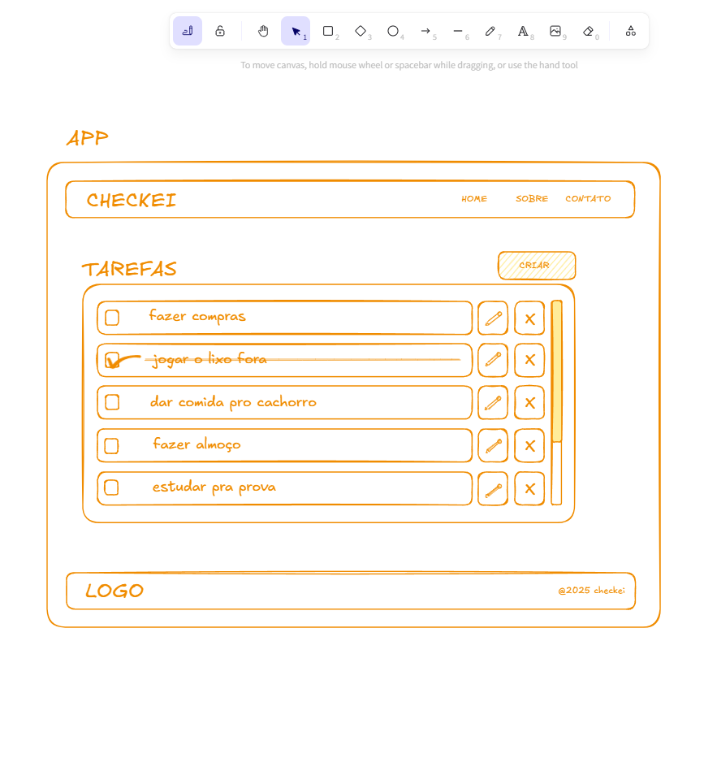
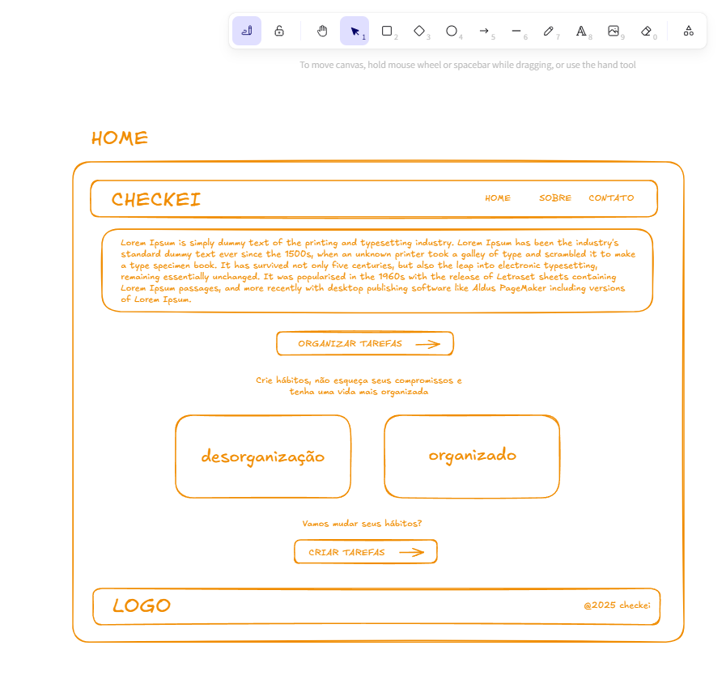
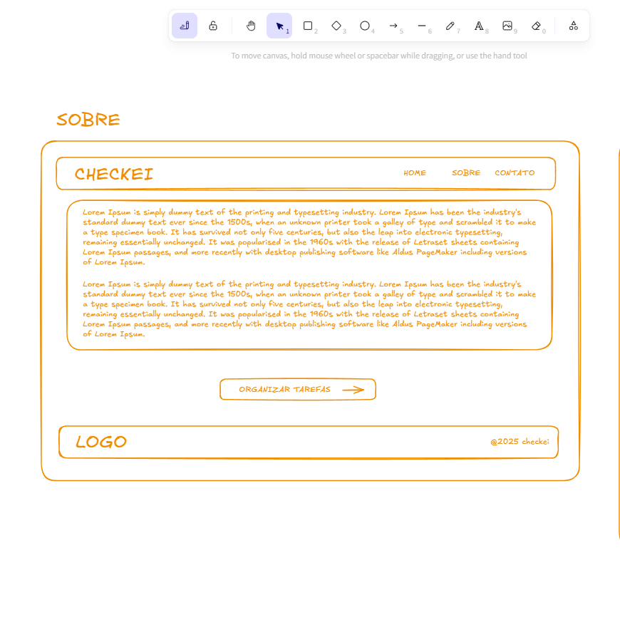
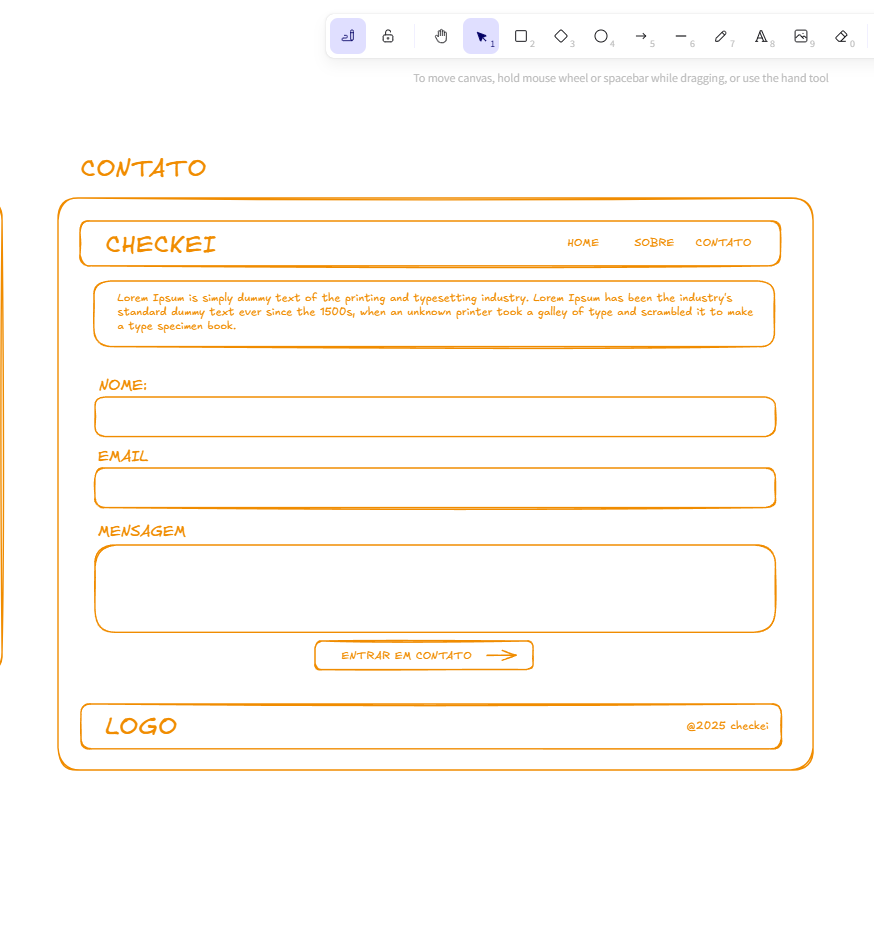

# CHECKEI - Plataforma de Organização Pessoal

> **Projeto Acadêmico - Programação Front-End**  
> **Instituição:** Unicesumar
> **Curso:** Engenharia de Software

## 📋 Sobre o Projeto

O **CHECKEI** é uma aplicação web de gerenciamento de tarefas desenvolvida como projeto final da disciplina de Programação Front-End. A aplicação oferece uma interface simples e eficiente para organizar tarefas diárias.

## 🚀 O que a Aplicação Faz

### Funcionalidades Principais
- **Gerenciamento de Tarefas:** Adicionar, editar, concluir e excluir tarefas
- **Filtros:** Visualizar tarefas por status (todas, pendentes, concluídas)
- **Estatísticas:** Acompanhar progresso diário de produtividade
- **Armazenamento Local:** Dados persistidos no navegador
- **Exportação:** Backup das tarefas em formato JSON

### Páginas da Aplicação
- **Home:** Página inicial, apresentação da ferramenta
- **App:** Aplicação de gerenciamento de tarefas
- **Sobre:** Informações sobre o projeto
- **Contato:** Formulário de contato

## 🛠️ Tecnologias Utilizadas

### Frontend Core
- **HTML5:** Estruturação semântica
- **CSS3:** Layouts responsivos com Flexbox e Grid
- **JavaScript:** Interatividade e manipulação do DOM

### Bibliotecas
- **Alpine.js:** Framework reativo para interatividade
- **Font Awesome:** Ícones vetoriais

## 📚 Referências e Documentação

- [GitHub Pages Documentation](https://pages.github.com/) - Deploy e configuração
- [Alpine.js Documentation](https://alpinejs.dev/) - Framework JavaScript
- [Font Awesome](https://fontawesome.com/) - Ícones e componentes
- [MDN Web Docs](https://developer.mozilla.org/en-US/) - Documentação web
- [Stripe Documentation](https://stripe.com/) - Referência para o design do site

## 📄 Licença
Este projeto foi desenvolvido para fins educacionais na Unicesumar. Todo o código é de uso livre para estudos e aprendizado.
